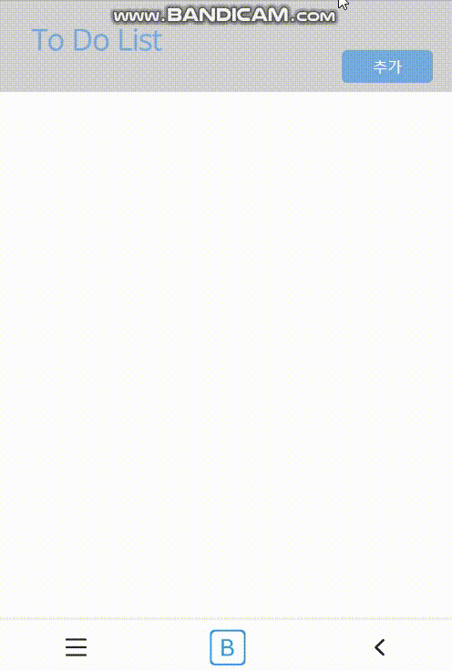
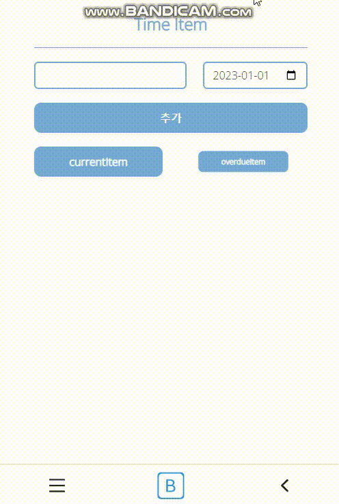
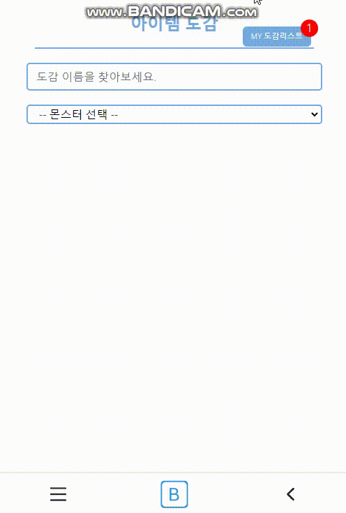
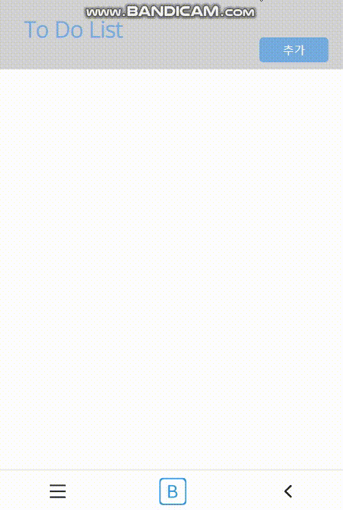
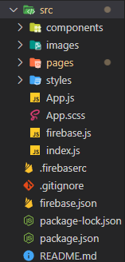
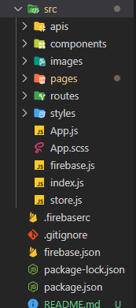
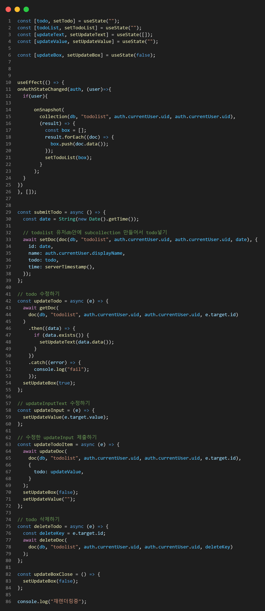
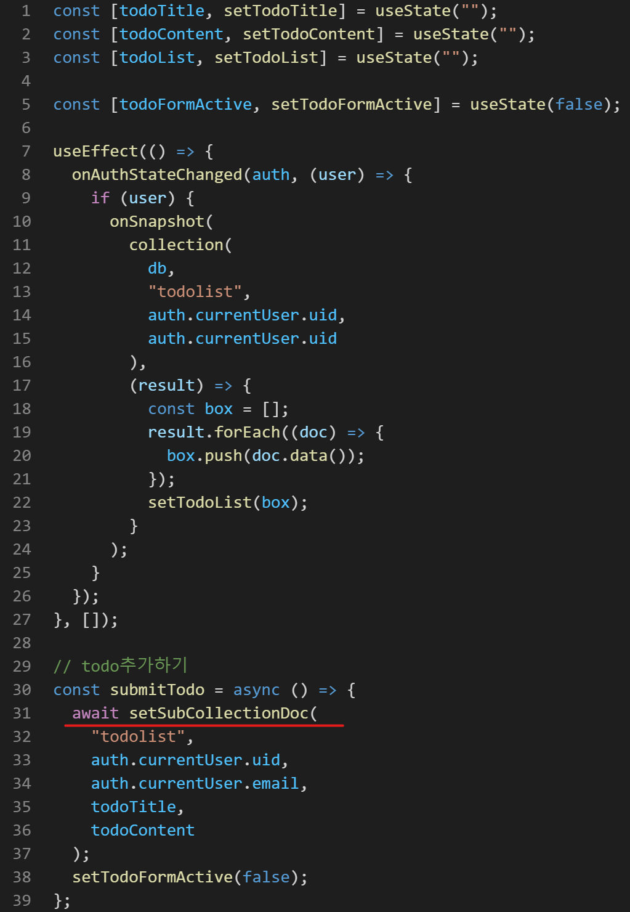

#  Game-Tool

---

### :white_square_button: 개발 배경
예전 게임을 하던 중 불편한 부분이 너무 많았습니다. 내가 오늘 무슨 퀘스트를 해야하지? 기간제 아이템이 언제 끝나지? 내가 채우지 못한 도감은 무엇이 있지? 이러한 부분을 해결하고 싶었고 실제로 하는 게임이다보니 작업을 하면서도 재미있게 할 수 있을거 같았습니다. 그리고 실제로 배포를 해보면 **이용자들에게 실시간으로 피드백**을 받아 볼 수도 있을거 같았고 그 부분은 제가 **앞으로 개발을 계속 해 나가야 할때에 가장 중요한 부분**이라고 생각이 되었습니다.

##### 2023-01-19 유지 관리를 위해 리팩토링

배포 : https://labuff-8c713.web.app/

(테스트용 계정  id : test@gmail.com / password : !asdf1234)

#### :grey_exclamation: 느낀점
- 피드백을 수용하고 바꿔가다보니 **유지보수를 염두해 두고 코드를 작성 하는게 얼마나 중요**한지 이해 할수 있게 되었습니다. 
- **typescript**를 배운다면 apis에서 가져온 firebase **api 들을 좀 더 유연**하게 사용할 수 있었을 텐데 하는 아쉬움이 있었고 typescript의 필요성을 느끼게 되었습니다. 특히 api에서 보내는 **객체의 값들이 조금씩 변동이 생기는데 typescript가 있다면 그러한 부분을 채울 수 있을 것** 같습니다.
- 이번에는 firebase를 이용하였지만 만약 node를 이용한 서버와의 통신에서 fetch, axios 등을 사용할때 **react-query나 rtk-query**를 이용하면 **캐싱**을 사용하여 좀 더 사용자에게 빠르게 정보를 보여줄 수 있다는 사실을 알게 되었고 반드시 공부가 필요한 부분이라고 느끼게 되었습니다.
- 기간제 아이템 같은 경우 d-day를 좀 더 시각화 시킬 수 있다면 한눈에 보기 좋을 것 같다고 느껴져서 **데이터 시각화**도 공부를 해야겠다고 느꼈습니다.

---
#### :hammer: 패키지
      

---

### :white_square_button: 구현

#### :one: 회원가입 인증 [아이디 중복확인]
##### :pencil2:Register.jsx
|구현화면|
|--------|
||

#### :two: todolist CRUD
##### :pencil2: TodoCard.jsx, Todolist.jsx
|구현화면|
|--------|
||

#### :three: 기간제 아이템 체크하기
##### :pencil2:  Timeitem.jsx, CurrentItem.jsx, OverdueItem.jsx
|구현화면|
|--------|
||

#### :four: 아이템 도감 체크하기 [redux-toolkit 으로 도감 갯수 확인]
##### :pencil2: Illust.jsx, IllustDetail.jsx, IllustResultBox.jsx, MyIllustBox.jsx, store.js
|구현화면|
|--------|
||

#### :five: Navbar, Footer 
##### :pencil2: Navbar.jsx, Footer.jsx
|구현화면|
|--------|
||

---

### :factory: 리팩토링

#### :one: 폴더구조
|수정 전 |수정 후 |
|--------|----|
|| |

 - **apis 폴더**를 만들어서 **디버그 하거나 후에 유지 보수**를 편하게 하기 위해 apis를 한곳에 모아놓은 폴더를 만들었습니다.

 - 모든 components를 모아 놓은 **routes 폴더**를 만들어서 관리하였습니다.

 #### :two: apis를 이용한 코드 리팩토링 
|:pencil2: apis.js|
|---|
||

|수정 전|수정 후 :pencil2: Todolist.jsx|
|--------|----|
|| |

- components의 분리와 apis(**setSubCollectionDoc**) 를 이용하여 **86줄의 코드를 39줄**로 줄일 수 있었습니다.
- 그 외에도 모든 파일에 apis를 이용하여 대부분 코드를 최소 절반 이하로 줄일 수 있었습니다.
