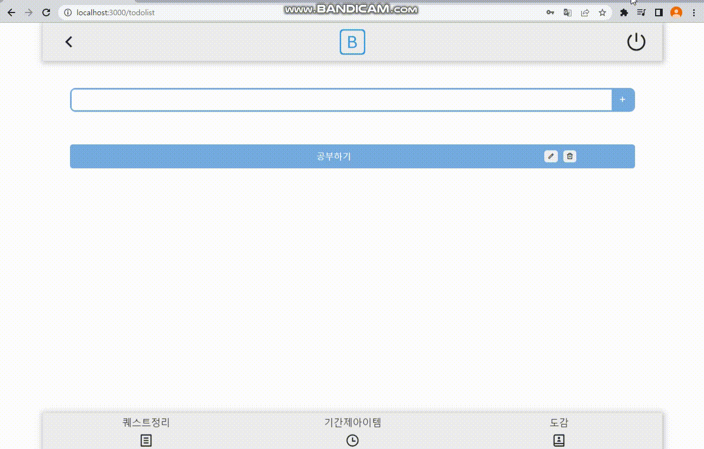
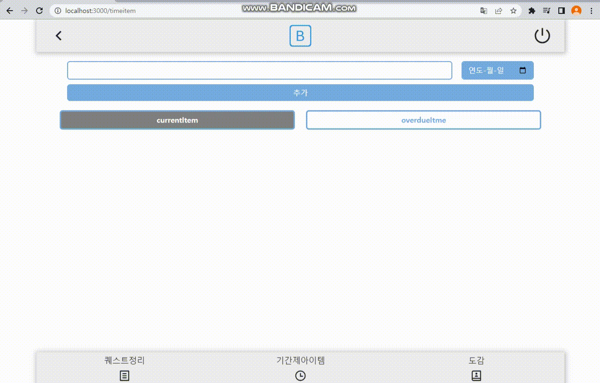
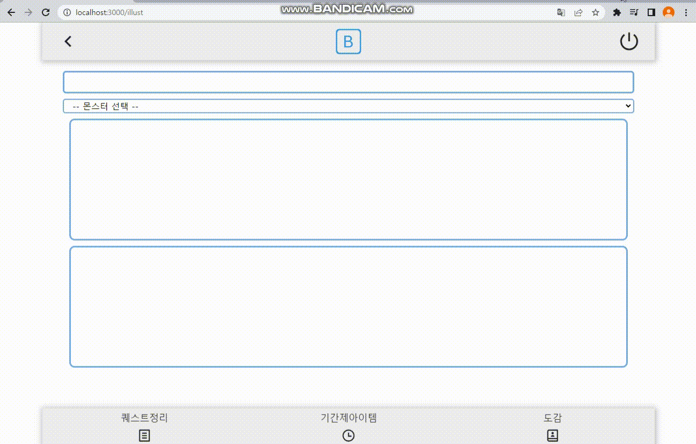

# gametool site
---
### 소개

- 게임을 좀 더 편하게 하기위한 간단한 툴
  - CRUD
  - 기간제 아이템 확인 
  - 도감 체크 
---

### 라이브러리

---

### 기능

- CURD
  - 기본적인 crud 기능으로 퀘스트 정리 용도로 사용

- 기간제 아이템 확인
  - 기간제 아이템을 등록시켜 놓으면 기간이 남은 아이템 과 기간이 지난 아이템을 구분 시켜 주는 기능

- 도감
  - 전체 도감 목록에서 비활성화 도감만 추가시켜서 사용하는 기능
  
  
