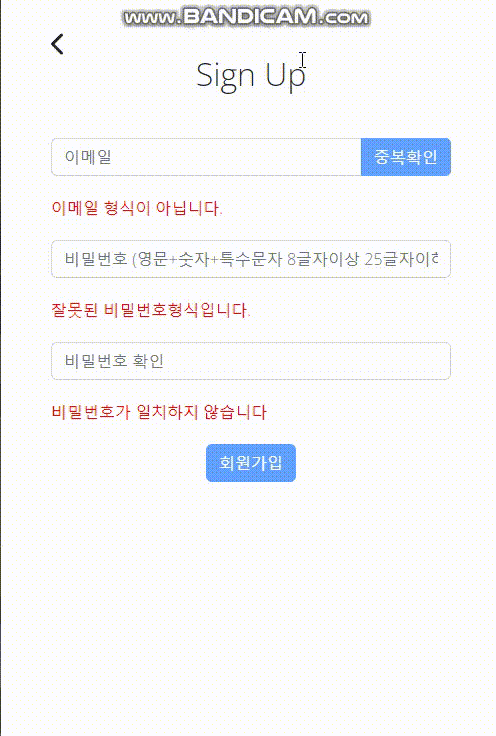
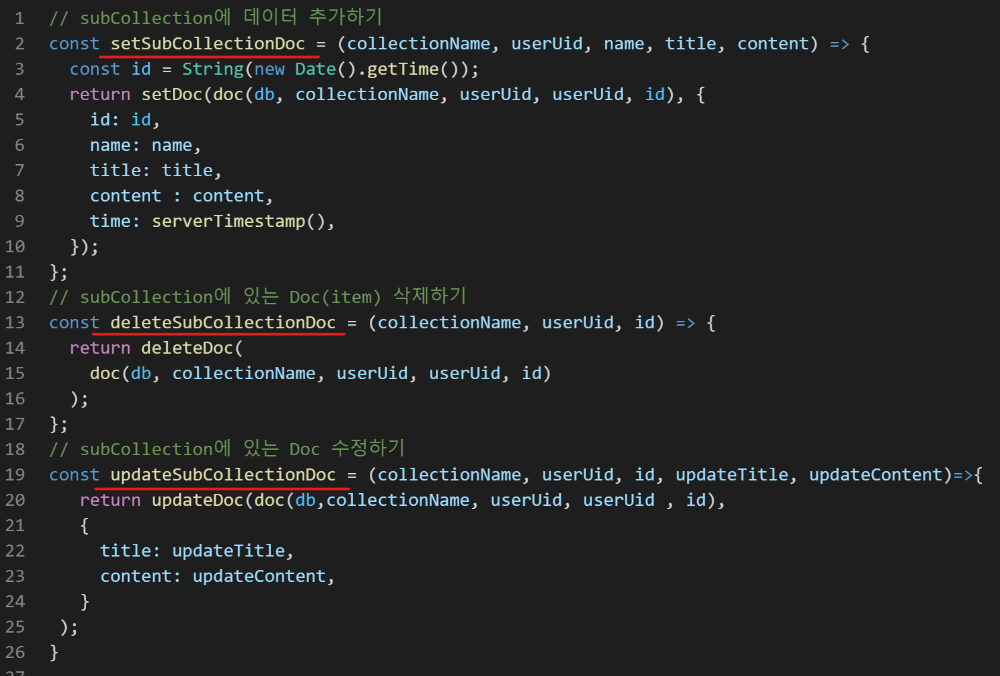

#  Game-Tool

---

### :white_square_button: 개발 배경
예전 게임을 하던 중 불편한 부분이 너무 많았습니다. 내가 오늘 무슨 퀘스트를 해야하지? 기간제 아이템이 언제 끝나지? 내가 채우지 못한 도감은 무엇이 있지? 이러한 부분을 해결하고 싶었고 실제로 하는 게임이다보니 작업을 하면서도 재미있게 할 수 있을거 같았습니다. 그리고 실제로 배포를 해보면 **이용자들에게 실시간으로 피드백**을 받아 볼 수도 있을거 같았고 그 부분은 제가 **앞으로 개발을 계속 해 나가야 할때에 가장 중요한 부분**이라고 생각이 되었습니다.


배포 : https://labuff-8c713.web.app/

(테스트용 계정  id : test@gmail.com / password : !asdf1234)


---
#### :hammer: 패키지
      

---

### :white_square_button: 구현


#### :one: 회원가입 인증 [아이디 중복확인]


<table>
<tr>
<td><h5>구현화면</td>
<td>

##### :pencil2:Register.jsx [아이디 중복확인 구현코드]
</td>
</tr>
<tr>
<td></td>
<td>

```javascript
  const idCheck = async () => {
    setIdCheckButton(true);
    const FetchId = await getDocs(getUserDoc("users", "email", email));
    FetchId.forEach((doc) => {
      if (doc.exists()) {
        alert("존재하는 아이디입니다.");
        setIdCheckButton(false);
      }
    });
  };
```
</td>
</tr>
<table>

- 아이디를 입력하고 중복확인(idChek)을 누를시 **button의 상태가 true**가 되면서  db에서 입력한 아이디의 유저정보를 가져오는데 만약 **db에 존재**할 경우 "존재하는 아이디입니다."라고 alert창을 띄우고 **button의 상태는 다시 false**가 되고 **db에 존재하지 않을 경우 true값이 그대로 유지** 됩니다.


#### :two: todolist CRUD [Update 구현코드]

<table>
<tr>
<td><h5>구현화면</td>
<td>

##### :pencil2:TodoCard.jsx 
</td>
</tr>
<tr>
<td></td>
<td>

```javascript
        {updateForm === false ? (
          <>
            <CardTitle>{item.title}</CardTitle>
            <CardText>{item.content}</CardText>
            <Button id={item.id} onClick={() => {
                setUpdateForm(true);
                setUpdateTitle(item.title);
                setUpdateContent(item.content);}}>
              <BsFillPencilFill />
            </Button>
          </>
        ) : (
          <>
            <Input defaultValue={item.title} onChange={(e) => 
            {setUpdateTitle(e.target.value);}}/>
            <Input style={{ marginTop: "5px" }} defaultValue={item.content} onChange={(e) => {
                setUpdateContent(e.target.value);}}/>
            <Button id={item.id} onClick={() => {
                updateTodo(item.id);}} >
              <BsCheckLg />
            </Button>
          </>
        )}
```
</td>
</tr>
<table>

- **Card 과 Input(update)에 가져온 데이터를 전부 바인딩** 시켜놓고 수정 버튼 클릭시 updateForm에 할당된 **boolean 값을 변경시켜 Card 과 Input(update)을 번갈아 보여주게 구현**하였습니다.


#### :three: 기간제 아이템 체크하기 [기간남은 아이템, 기간지난 아이템 구분 구현코드]


<table>
<tr>
<td><h5>구현화면</td>
<td>

##### :pencil2:Timeitem.jsx 
</td>
</tr>
<tr>
<td></td>
<td>

```javascript
  useEffect(() => {
    onAuthStateChanged(auth, (user) => {
      if (user) { onSnapshot(
        collection( db, "timeitem", auth.currentUser.uid,auth.currentUser.uid
          ),
          (result) => {
            const current = [];
            const overdue = [];
            result.forEach((doc) => {
              const today = new Date();
              let today2 = new Date(today.setDate(today.getDate() - 1));

              if (Number(doc.data().content) - today2 > 0) {
                current.push(doc.data());
              } else {
                overdue.push(doc.data());
              }
            });
            setCurrentItemBox(current);
            setOverdueItemBox(overdue);
          }
        );
      }
    });
    return;
  }, []);
```
</td>
</tr>
<table>

- db에서 가져온 **item의 날짜값(doc.data().content)에서 당일 00시의 값(today2)을 뺀 값**이 **0보다 클경우 기간이 남아있다는 의미이므로 currentItemBox**(기간남은 아이템)에 넣어서 보여주었고 **0보다 작을 경우 overdueItemBox**(기간이 지난 아이템)에 넣어서 보여주는 식으로 구현하였습니다.


#### :four: 아이템 도감 체크하기 [redux-toolkit 으로 도감 갯수 확인]
<table>
<tr>
<td><h5>구현화면</td>
<td>

##### :pencil2: store.js , MyillustBox.jsx, illustResultBox.jsx
</td>
</tr>
<tr>
<td></td>
<td>

```javascript
1.
const illustQuantity = createSlice({
    name : "illustQuantity",
    initialState :  0,
    reducers : {
        renderQuantity(state, action){
           return state = action.payload
        },
    }
})
export let {renderQuantity} = illustQuantity.actions

export default configureStore({
    reducer : {
        illustQuantity : illustQuantity.reducer,
    }
})
```
```javascript
2.
 useEffect(() => {
    onAuthStateChanged(auth, (user) => {
      onSnapshot(
        collection(db, "myillust", auth.currentUser.uid, auth.currentUser.uid),
        (result) => {
          let box = [];
          result.forEach((doc) => {
            box.push(doc.data());
          });
          setMyIllust(box);
          dispatch(renderQuantity(box.length));
        }
      );
    });
  }, []);
```
</td>
</tr>
<table>

- 1. illustQuantity 슬라이스를 만들어 기본값을 0으로 주어 export 시켜서 illust 페이지에 import를 시켜 놓았습니다.
- 2. useEffect를 사용하여 **컴포넌트 mount시 가져온 데이터의 length 값을 dispatch를 사용하여 값을 변경** 시켜주었고 **onSnapshot을 사용**하여 db에 **데이터가 변경시** 자동으로 **최신화** 시켜주어 도감을 추가하거나 삭제시 도감갯수를 변경되게 하였습니다.

---

### :factory: 리팩토링

#### :one: 폴더구조
|수정 전 |수정 후 |
|--------|----|
|| |

 - **apis 폴더**를 만들어서 **디버그 하거나 후에 유지 보수**를 편하게 하기 위해 apis를 한곳에 모아놓은 폴더를 만들었습니다.

 - 모든 components를 모아 놓은 **routes 폴더**를 만들어서 관리하였습니다.

 #### :two: apis를 이용한 코드 리팩토링 
|:pencil2: apis.js|
|---|
||

|수정 전|수정 후 :pencil2: Todolist.jsx|
|--------|----|
|| |

- components의 분리와 apis(**setSubCollectionDoc**) 를 이용하여 **86줄의 코드를 39줄**로 줄일 수 있었습니다.
- 그 외에도 모든 파일에 apis를 이용하여 대부분 코드를 최소 절반 이하로 줄일 수 있었습니다.

---

#### :grey_exclamation: 느낀점
- 도감 갯수 체크시 **여러 components와 연결이 될거같아 redux-toolkit을 사용**해 보았는데, 확실히 상태값을 변동시키는데 **코드자체가 길지 않아 작성하는데 편하였고 후에 변경시에도 부담이 없었다.** 다만 firebase에서 onSnapshot을 제공하여 **redux-toolkit의 역할이 크지 않아** **Context API로도 충분하지 않았을까 생각**되었다.
- 피드백을 수용하고 바꿔가다보니 **유지보수를 염두해 두고 코드를 작성 하는게 얼마나 중요**한지 깨닫고 **apis 폴더를 만들어 자주 사용되는 api 모듈형식으로 구현하여 하였습니다.**
- **typescript**를 배운다면 apis에서 가져온 firebase **api 들을 좀 더 유연**하게 사용할 수 있었을 텐데 하는 아쉬움이 있었고 typescript의 필요성을 느끼게 되었습니다. 특히 api로 보내는 **객체의 값들이 조금씩 변동이 생기는데 typescript가 있다면 그러한 부분을 더 쉽게 할 수 있을 것 같습니다.
- 이번에는 firebase를 이용하였지만 만약 node를 이용한 서버와의 통신에서 fetch, axios 등을 사용할때 **react-query나 rtk-query**를 이용하면 **캐싱**을 사용하여 좀 더 사용자에게 빠르게 정보를 보여줄 수 있다는 사실을 알게 되었고 반드시 공부가 필요한 부분이라고 느끼게 되었습니다.
